# Azure

## Deploy Azure Infrastructure

Provision the resource group, ACR, model storage, Container Apps environment, Log Analytics, and Static Web App with Bicep. A user-assigned managed identity grants the ML worker permission to pull images from ACR.

See [main.bicep](multi-cloud-faas-platform/azure/infra/main.bicep), [resources.bicep](multi-cloud-faas-platform/azure/infra/resources.bicep), and [deployment parameters](multi-cloud-faas-platform/azure/infra/dev.bicepparam).

```bash
# From the repository root
cd multi-cloud-faas-platform

# Confirm the active subscription
az account show --query '{name:name,id:id}' -o table
export subscription_id="$(az account show --query id -o tsv)"

# Deploy the resource group and supporting infrastructure
az deployment sub create \
  --subscription "$subscription_id" \
  --name multicloud-faas-dev \
  --location australiaeast \
  --template-file azure/infra/main.bicep \
  --parameters azure/infra/dev.bicepparam
```

- Keep `deployMlWorker = false` for the initial deployment. Deploy the ML worker after publishing its container image and uploading `mdv5a.pt` and `model.pt`.
- Regional resources use `australiaeast`. Static Web Apps uses `eastasia` because its supported deployment regions differ.
- Models are stored in a private Blob container and downloaded at application startup, independently of the Docker image.
- In production, Azure DevOps pipelines can provision infrastructure with Bicep, build and push images to ACR, and deploy applications to Azure Container Apps. This lab runs these steps manually to demonstrate the same deployment flow.

```bash
# Verify deployment status and provisioned resources
az deployment sub show --subscription "$subscription_id" --name multicloud-faas-dev --query properties.provisioningState -o tsv

az resource list --subscription "$subscription_id" --resource-group rg-multicloud-faas-dev -o table
```

Deployment completed successfully:

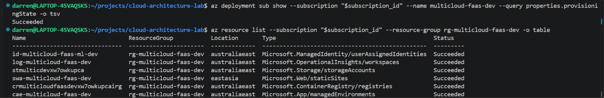

Provisioned Azure resources:

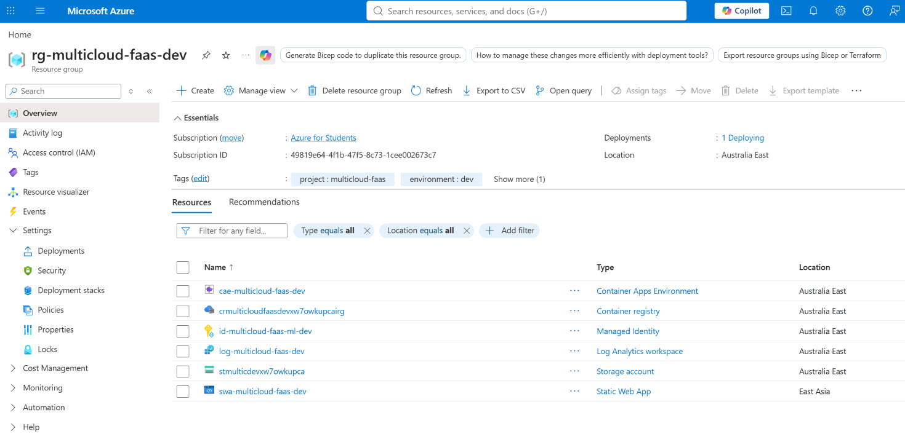

## Publish ML Model Artifacts

Model artifacts are managed separately from the inference container image. This allows models to be updated without rebuilding the application image, at the cost of downloading them when a new container starts.

Place `mdv5a.pt` and `model.pt` in `azure/src/ml-worker/models/`, then run from the `multi-cloud-faas-platform/` directory:

```bash
bash azure/src/ml-worker/script/upload-models.sh
```

In production, ML pipelines typically publish versioned models to a model registry for inference services to retrieve. This lab uses a local script and Blob Storage to simulate artifact publishing and startup retrieval; model registration and version promotion are outside its scope.

See [model upload script](multi-cloud-faas-platform/azure/src/ml-worker/script/upload-models.sh).

Upload logs:

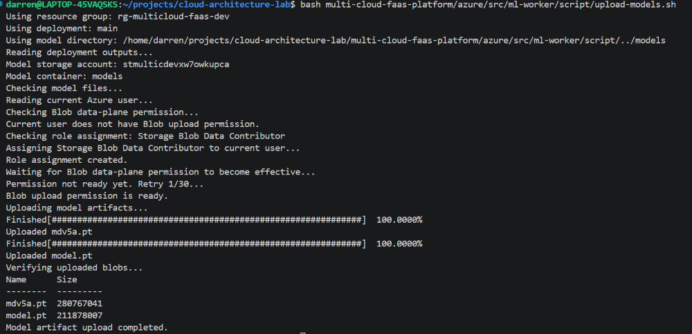

Both model artifacts in the Azure Blob Storage `models` container:

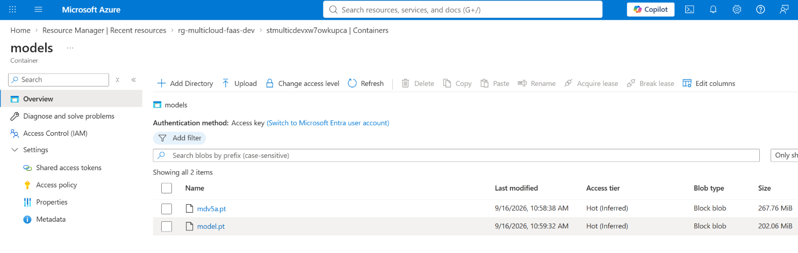

## Build and Push the ML Worker Image

Build the ML worker image and push it to ACR before deploying it to Azure Container Apps.

Run the following commands from the `multi-cloud-faas-platform/` directory:

```bash
# Read the registry details from Bicep deployment outputs
RESOURCE_GROUP="rg-multicloud-faas-dev"
DEPLOYMENT_NAME="main"

ACR_NAME=$(az deployment group show \
  --resource-group "$RESOURCE_GROUP" \
  --name "$DEPLOYMENT_NAME" \
  --query "properties.outputs.acrName.value" -o tsv)

ACR_SERVER=$(az deployment group show \
  --resource-group "$RESOURCE_GROUP" \
  --name "$DEPLOYMENT_NAME" \
  --query "properties.outputs.acrLoginServer.value" -o tsv)

# Log in to ACR
az acr login --name "$ACR_NAME"

# Build the ML worker image
docker build --platform linux/amd64 \
  -t "$ACR_SERVER/wildlife-ml-worker:latest" \
  azure/src/ml-worker/

# Push the image to ACR
docker push "$ACR_SERVER/wildlife-ml-worker:latest"

# Verify the published image tag
az acr repository show-tags \
  --name "$ACR_NAME" \
  --repository wildlife-ml-worker \
  --query "[].{Image: join('', ['${ACR_SERVER}/wildlife-ml-worker:', @])}" \
  -o table
```

In production, CI/CD pipelines, such as Azure Pipelines, build and push images to ACR and deploy them to Azure Container Apps. This lab builds and pushes the image manually, then deploys it using Bicep.

See [application source and Dockerfile](multi-cloud-faas-platform/azure/src/ml-worker/).

The image uses the `latest` tag configured in the Bicep deployment parameters. Model files are downloaded at startup and are excluded from the image.

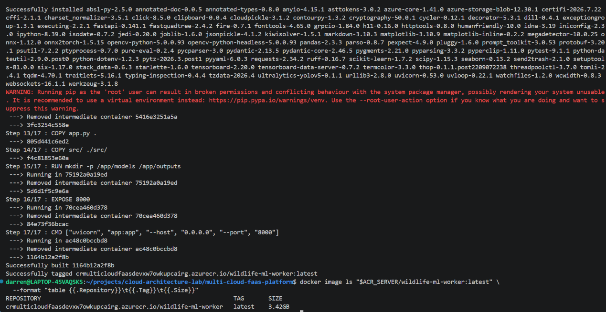

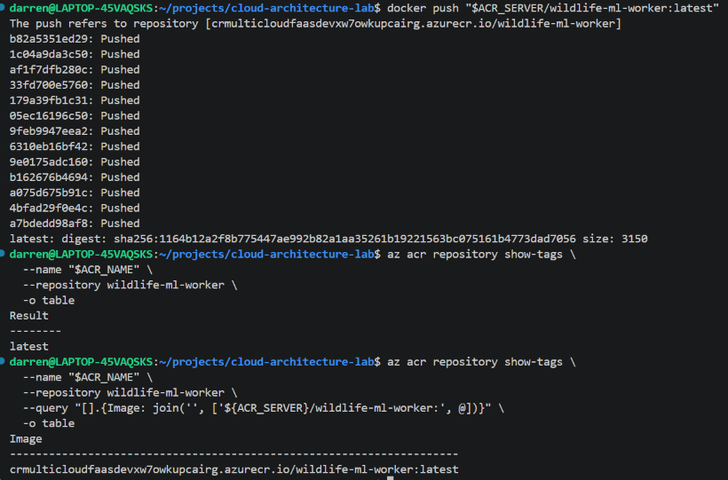

## Deploy the ML Worker to Azure Container Apps

Deploy the published image from ACR. The container downloads the model artifacts from Blob Storage during startup.

In production, CI/CD pipelines typically deploy container images to Azure Container Apps. This lab runs the Bicep deployment manually to demonstrate the same deployment step.

See [Container App configuration](multi-cloud-faas-platform/azure/infra/resources.bicep) and [deployment parameters](multi-cloud-faas-platform/azure/infra/dev.bicepparam).

After publishing the image and both model files, update `azure/infra/dev.bicepparam`:

```bicep
// Deploy the ML worker after publishing its image and model artifacts.
param deployMlWorker = true
```

Run from the `multi-cloud-faas-platform/` directory:

```bash
export subscription_id="$(az account show --query id -o tsv)"
RESOURCE_GROUP="rg-multicloud-faas-dev"
CONTAINER_APP="ca-multicloud-faas-ml-dev"

# Deploy the ML worker using the existing infrastructure
az deployment sub create \
  --subscription "$subscription_id" \
  --name multicloud-faas-dev \
  --location australiaeast \
  --template-file azure/infra/main.bicep \
  --parameters azure/infra/dev.bicepparam \
  --query "properties.provisioningState" \
  -o tsv

# Verify the deployed image and application status
az containerapp show \
  --resource-group "$RESOURCE_GROUP" \
  --name "$CONTAINER_APP" \
  --query "{Name:name,Provisioning:properties.provisioningState,Running:properties.runningStatus,Image:properties.template.containers[0].image}" \
  -o table

# Retrieve the application endpoint
ACA_FQDN=$(az containerapp show \
  --resource-group "$RESOURCE_GROUP" \
  --name "$CONTAINER_APP" \
  --query "properties.configuration.ingress.fqdn" \
  -o tsv)

export ACA_BASE_URL="https://${ACA_FQDN}"

# Verify HTTPS access and startup readiness
echo "$ACA_BASE_URL"
curl --fail-with-body --show-error "${ACA_BASE_URL}/health"
echo
```

The health endpoint should return `"status": "ok"` and `"model_files_ready": true`. This confirms startup readiness; model loading and inference are verified separately with a real image.

Deployment and endpoint verification:

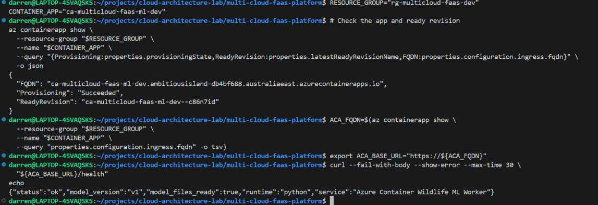

Container App details in the Azure portal:

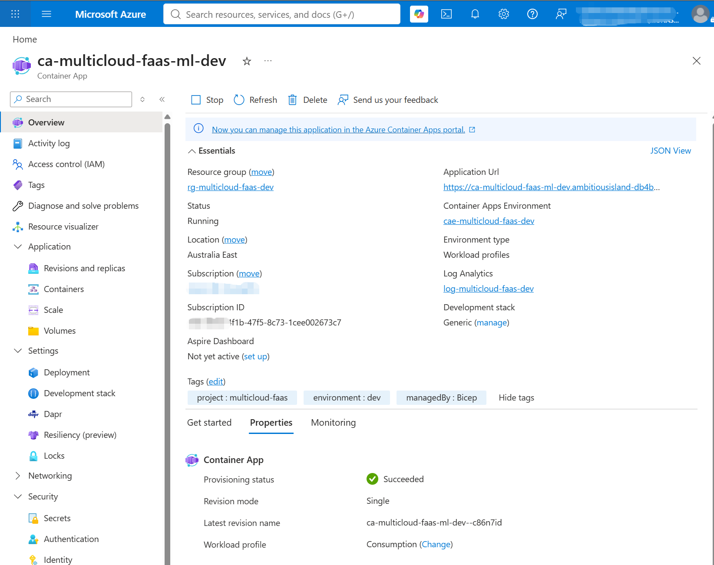

## Connect AWS Lambda to the Azure ML Worker

Use the deployed Container App's Application URL as the base address for AWS-to-Azure inference requests:

```text
https://ca-multicloud-faas-ml-dev.ambitiousisland-db4bf688.australiaeast.azurecontainerapps.io
```

Update the endpoint parameter defaults in the following SAM templates.

In [storage/template.yaml](multi-cloud-faas-platform/aws/infra/storage/template.yaml):

```yaml
  AzureImageProcessingEndpoint:
    Type: String
    Default: "https://ca-multicloud-faas-ml-dev.ambitiousisland-db4bf688.australiaeast.azurecontainerapps.io/process-image"
    Description: Azure Container Apps endpoint for image processing.

  AzureVideoProcessingEndpoint:
    Type: String
    Default: "https://ca-multicloud-faas-ml-dev.ambitiousisland-db4bf688.australiaeast.azurecontainerapps.io/process-video"
    Description: Azure Container Apps endpoint for video processing.
```

In [api/template.yaml](multi-cloud-faas-platform/aws/infra/api/template.yaml):

```yaml
  QueryFileAnalysisEndpoint:
    Type: String
    Default: "https://ca-multicloud-faas-ml-dev.ambitiousisland-db4bf688.australiaeast.azurecontainerapps.io/analyze-query-file"
    Description: Azure Container Apps endpoint for query-file analysis.
```

Commit and push these changes to trigger the AWS deployment pipeline. SAM passes the endpoint values into the Lambda environment variables.

This connects the two clouds: AWS Lambda sends HTTPS inference requests containing temporary S3 presigned URLs; the Azure ML worker retrieves the media and returns inference results. Model artifacts remain in Azure Blob Storage.

In production, service endpoints are typically managed as environment-specific configuration, for example in AWS Systems Manager Parameter Store, and injected into Lambda environment variables during deployment. This lab keeps the URLs in SAM parameter defaults for simplicity; the application code reads them from environment variables.

# AWS

## 1. Deploy the AWS Backend with CodePipeline

Changes pushed to `main` automatically trigger AWS CodePipeline. The Source stage retrieves the GitHub revision, and CodeBuild validates the SAM templates, builds the application, and deploys it to `ap-southeast-2`.

Pipeline setup details are omitted here. The deployment commands and infrastructure definitions are maintained in the repository.

See [CodeBuild build specification](multi-cloud-faas-platform/aws/buildspec.yml), [root SAM template](multi-cloud-faas-platform/aws/template.yaml), and [nested infrastructure templates](multi-cloud-faas-platform/aws/infra/).

The root template coordinates five stacks: authentication, data, storage, API, and notifications. SAM deployment runs inside the CodeBuild stage.

### Pipeline Execution

The commit updating the Azure ML endpoints automatically triggered the pipeline. Both Source and Build completed successfully.

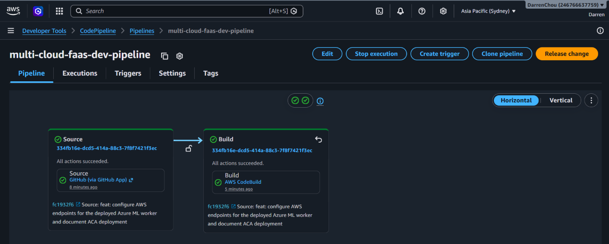

### SAM Deployment

CodeBuild runs `sam validate --lint`, `sam build`, and `sam deploy`, then prints the deployed endpoints and resource identifiers.

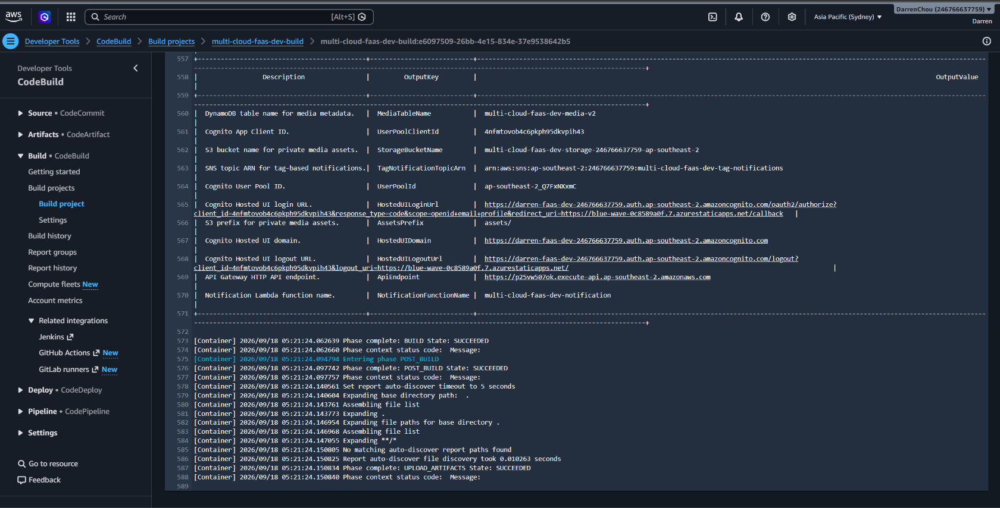

## 2. Manage Infrastructure with AWS SAM and CloudFormation

The AWS backend is defined using AWS SAM. SAM provides shorthand syntax for serverless resources, while CloudFormation manages their provisioning, dependencies, and updates.

The root stack, `multi-cloud-faas-dev-aws`, coordinates five nested applications. Each is deployed as a CloudFormation nested stack, separating infrastructure by responsibility.

| Nested stack | Responsibility |
| --- | --- |
| `AuthStack` | Amazon Cognito user pool, app client, and hosted authentication domain |
| `DataStack` | DynamoDB media metadata table and change stream |
| `StorageStack` | Private S3 media bucket and Lambda function for event-driven processing |
| `ApiStack` | API Gateway routes, JWT authorization, and Lambda functions for uploads and queries |
| `NotificationStack` | Lambda function consuming DynamoDB Streams and an SNS notification topic |

CodeBuild deploys the root template through `sam deploy`, allowing CloudFormation to coordinate updates across the nested stacks.

See [root SAM template](multi-cloud-faas-platform/aws/template.yaml) and [nested infrastructure templates](multi-cloud-faas-platform/aws/infra/).

The root stack and its five nested stacks show successful deployment states:

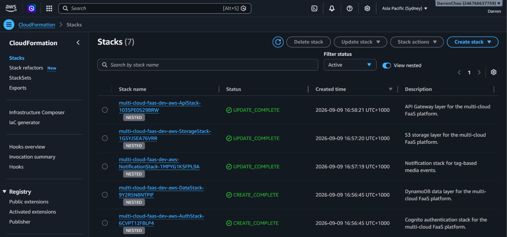

## 3. Authenticate API Requests with Amazon Cognito and API Gateway

Amazon Cognito manages user authentication, while API Gateway exposes the backend HTTP API with a JWT authorizer.

The Cognito app client is configured for the OAuth 2.0 authorization code flow. After sign-in, the frontend exchanges the authorization code for tokens and includes a JWT in the `Authorization: Bearer <token>` header when calling the API.

See [Cognito infrastructure template](multi-cloud-faas-platform/aws/infra/auth/template.yaml).

The Cognito user pool provides the identity service and token-signing keys used by the API's JWT authorizer:

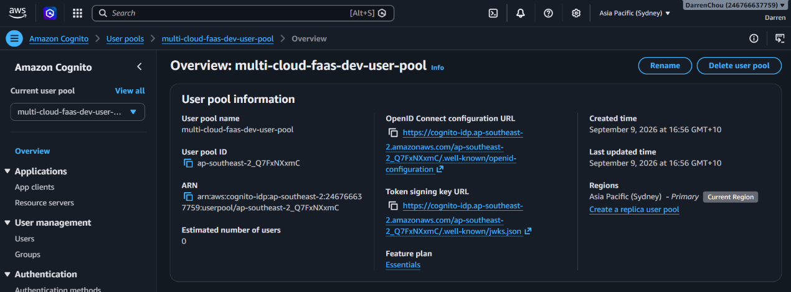

API Gateway uses the Cognito user pool as the JWT issuer issuer and the app client ID as the expected audience. It validates the token before forwarding requests on requests on protected routes to Lambda.

See [API Gateway and Lambda infrastructure template](multi-cloud-faas-platform/aws/infra/api/template.yaml).

The JWT authorizer connects the API authentication configuration to the Cognito user pool:

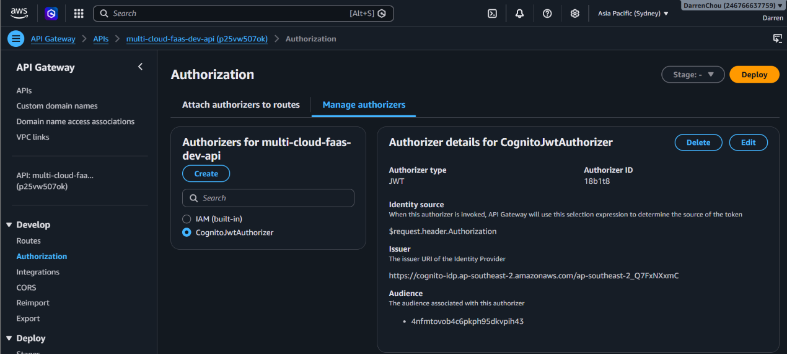

## 4. Store Media and Deployment Artifacts in Amazon S3

Amazon S3 serves two separate purposes in this project: storing application media and storing deployment artifacts.

### Media Storage

The upload API invokes `UploadInitFunction` to validate the request, create an initial metadata record in DynamoDB, and return a presigned S3 upload URL. The client then uploads the file directly to S3, keeping media payloads out of API Gateway and Lambda.

The media bucket blocks public access and enables server-side encryption and versioning. Uploaded objects under `assets/` trigger the processing workflow described in the next section.

See [upload initialization function](multi-cloud-faas-platform/aws/src/upload_init/app.py) and [S3 infrastructure template](multi-cloud-faas-platform/aws/infra/storage/template.yaml).

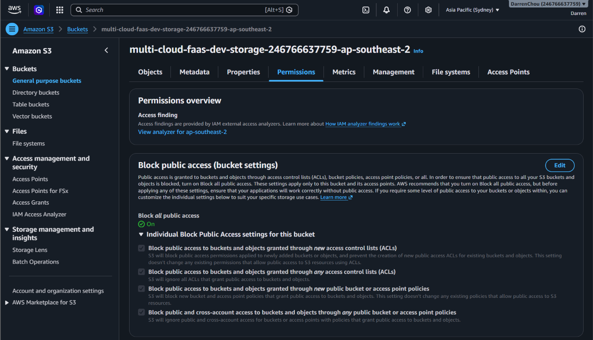

### SAM Deployment Artifacts

During deployment, CodeBuild runs `sam deploy --resolve-s3`. SAM uploads packaged Lambda code and nested templates to a separate S3 artifact bucket for deployment through CloudFormation.

This bucket stores deployment artifacts; CloudFormation manages stack state. Keeping deployment artifacts separate from user media gives each bucket a distinct purpose and access boundary.

See [CodeBuild build specification](multi-cloud-faas-platform/aws/buildspec.yml).

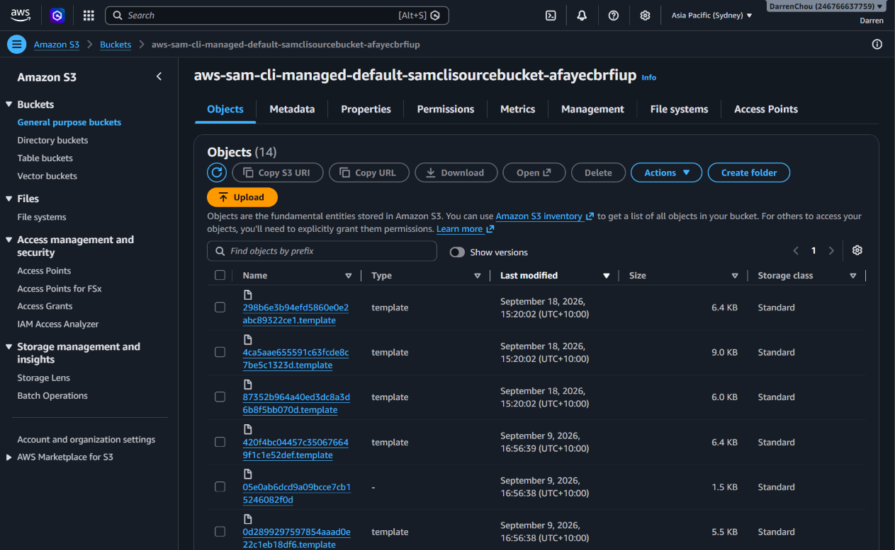

## 5. Run Cross-Cloud Inference with Lambda and Azure Container Apps

AWS Lambda coordinates media processing, while Azure Container Apps runs the ML inference workload. The two services communicate over HTTPS.

### S3 Event Trigger

An `s3:ObjectCreated:*` notification on the `assets/` prefix invokes `MediaIngestFunction`. This starts processing asynchronously after the client uploads a file.

See [S3 notification and Lambda configuration](multi-cloud-faas-platform/aws/infra/storage/template.yaml).

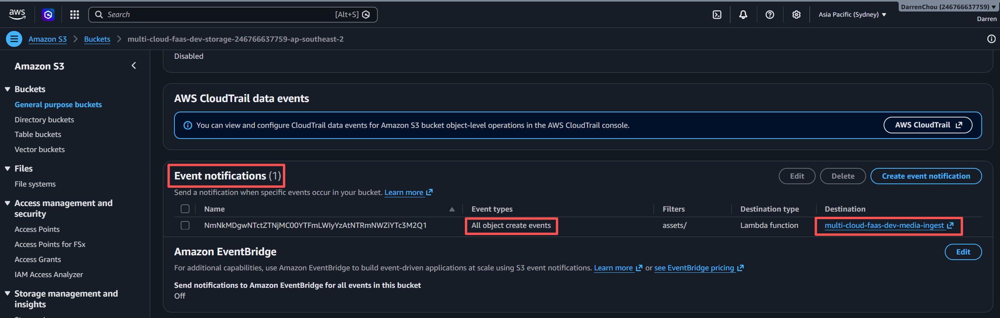

### Cross-Cloud Processing

Lambda generates a temporary presigned GET URL for the uploaded object and sends it to the Azure ML worker. The worker retrieves the media directly from S3, runs inference, and returns the results.

Lambda then updates the processing status, detected tags, and model version in DynamoDB. When a thumbnail is returned, Lambda saves it to S3.

The image and video endpoints are supplied through Lambda environment variables:

| Environment variable | Azure endpoint |
| --- | --- |
| `AZURE_IMAGE_PROCESSING_ENDPOINT` | `/process-image` |
| `AZURE_VIDEO_PROCESSING_ENDPOINT` | `/process-video` |

See [media ingest function](multi-cloud-faas-platform/aws/src/media_ingest/app.py) and [Azure ML worker](multi-cloud-faas-platform/azure/src/ml-worker/app.py).

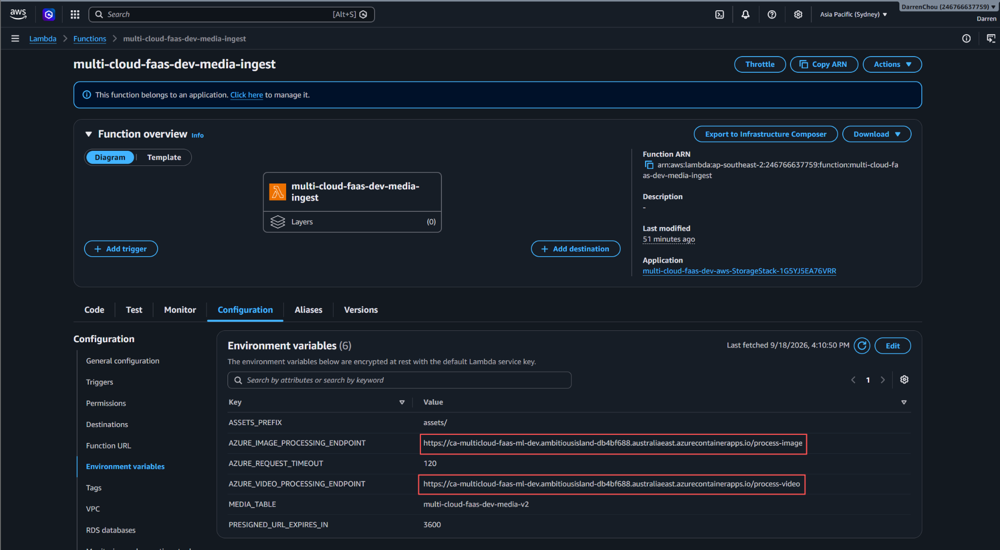

## 6. Query Media Metadata with API Gateway and DynamoDB

Amazon DynamoDB stores media metadata, including S3 object references, processing status, detected tags, and model version. API Gateway exposes Lambda-backed routes for querying these records.

### Metadata Storage

The `multi-cloud-faas-dev-media-v2` table uses a composite primary key (`pk`, `sk`) and on-demand capacity. Media files remain in S3, while DynamoDB holds the metadata used to track and retrieve them.

DynamoDB Streams captures both the previous and updated item values for the notification workflow described in the next section.

See [DynamoDB infrastructure template](multi-cloud-faas-platform/aws/infra/data/template.yaml).

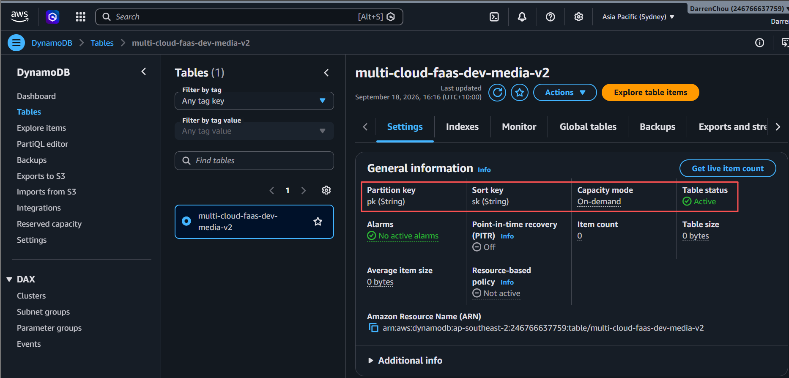

### Query APIs

The API supports several ways to find stored media:

| Route | Purpose |
| --- | --- |
| `POST /query/tags` | Find completed media matching the requested tags and minimum counts |
| `GET /query/species` | Find completed media containing a specified species |
| `POST /query/thumbnail` | Resolve a thumbnail URL to its original media record |
| `POST /query/by-file` | Analyze a query file with the Azure ML worker and find completed media matching its detected tags |

The lab uses DynamoDB scans for metadata searches. Query-by-file matches detected tags rather than vector similarity.

See [API infrastructure template](multi-cloud-faas-platform/aws/infra/api/template.yaml), [metadata query implementation](multi-cloud-faas-platform/aws/src/media_api/query_service.py), and [query-by-file function](multi-cloud-faas-platform/aws/src/query_by_file/app.py).

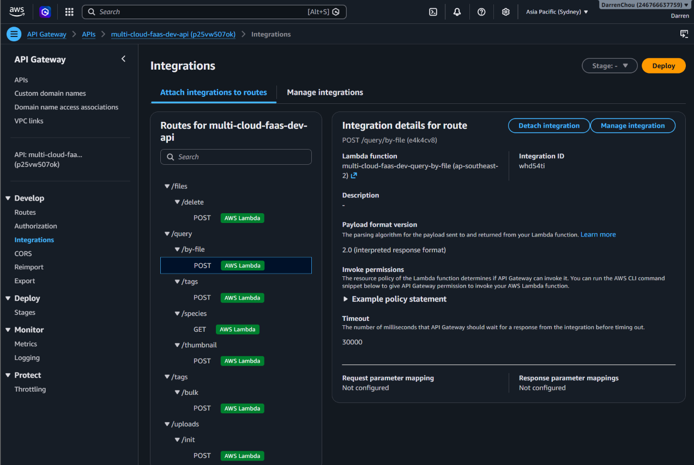

## 7. Send Notifications with DynamoDB Streams, Lambda, and SNS

DynamoDB Streams connects metadata changes to a separate notification workflow, keeping notification logic independent of media processing.

### Process Metadata Changes

The media table stream captures both old and new item values. `NotificationFunction` consumes these records and publishes an event when a media record reaches `COMPLETED` with non-empty tags, or when the tags of an already completed record change.

Unrelated updates are skipped.

See [DynamoDB stream configuration](multi-cloud-faas-platform/aws/infra/data/template.yaml) and [notification function](multi-cloud-faas-platform/aws/src/notification/app.py).

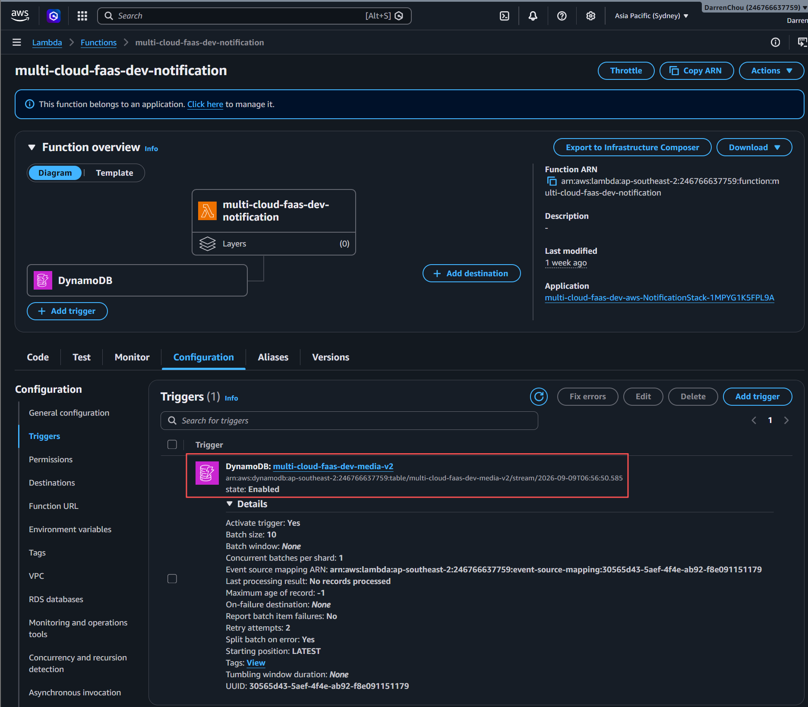

### Publish Events to SNS

The function publishes a `MediaTagged` event to the `multi-cloud-faas-dev-tag-notifications` SNS topic. Messages include the file ID, media type, detected tags, and S3 object references.

Message attributes include the event type, media type, and tag names, allowing subscriptions to filter relevant notifications.

The SAM template provisions the topic and publisher. Subscription setup and message delivery are covered during end-to-end validation.

See [notification infrastructure template](multi-cloud-faas-platform/aws/infra/notification/template.yaml).

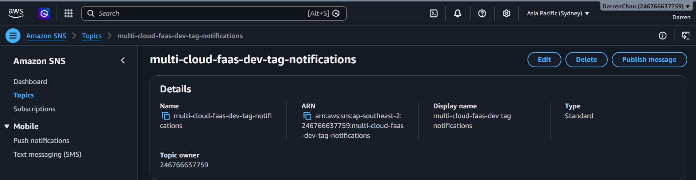